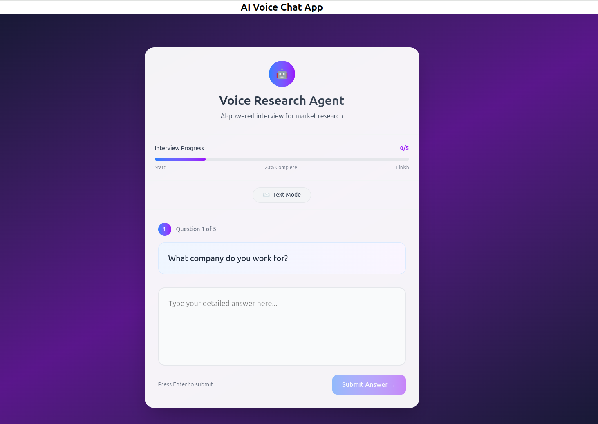

# AI-Powered Voice Customer Onboarding Agent

This project is an AI-driven voice-based customer onboarding flow built entirely in **TypeScript**. It replaces traditional web forms with a natural, real-time conversational interface to capture user data, validate business info, and generate a structured onboarding report.

## Overview

The voice agent engages users through voice input, asking key onboarding questions, validating company industry status through a mocked API, and generating a summarized report. It supports fallback to text input and handles off-topic or vague responses gracefully, creating a smooth, human-like conversational experience.

## Features
- **Handles some vague topics/speech**  

- **Voice Input & Transcription**  
  Utilizes browser or Node-compatible voice input APIs (e.g., Web Speech API or Whisper) to convert speech to text in real time.

- **Conversational Data Capture**  
  Collects essential user onboarding data through a dynamic conversation:
  - Company name
  - User role
  - Research objectives
  - Industry confirmation (validated via mocked API)
  - Preferred output format for results

- **Industry Validation**  
  Calls a mocked `/api/validate-industry` endpoint that returns whether the company is in the food and beverage sector, along with a mock company overview.

- **Natural Dialogue Flow**  
  Handles fallback to text input and manages vague or off-topic answers with appropriate follow-up prompts.

- **Report Generation**  
  Summarizes collected data into a structured JSON report including fields like `companyName`, `role`, `objective`, and `companyOverview`.

- **Transcript Persistence**  
  Saves the entire conversation transcript and the final report locally in files for review and testing.

## Tech Stack

- **TypeScript** for type-safe development
- **Web Speech API** (or alternative) for voice recognition and speech synthesis
- **Node.js** backend with Express (or similar) for mocked API endpoint and file handling
- OpenAI API for AI-based conversation management and summarization (starter template includes a key)
- NewsAPI used to get news about the company
- Filesystem for transcript and report storage

## Setup & Running
add .env file with OPENAI_API_KEY and NEWS_API


### Advanced Agentic Capabilities (Highly Optional)
implemented in this project, here is an outline:

- **Dynamic Research Agent**  
  An intelligent agent that dynamically researches the company mentioned by the user to enrich the onboarding data.

- **Company Intelligence Gathering**  
  Integrate web APIs such as news APIs about the company 
  
 ### financial data services, and official company websites to automatically gather and update `companyOverview` with real-time, accurate information.

- **Industry Analysis**  
  Fetch real-time industry trends, competitor insights, and market data specifically for the food & beverage sector to provide deeper context and validation.

- **Tool Integration**  
  Use web scraping tools,  and company databases to augment the agent’s knowledge base and enhance conversational intelligence.

---

1. **Clone the repo**

   ```bash
   git clone https://github.com/yourusername/ai-voice-onboarding.git
   cd ai-voice-onboarding
   npm run dev:all

## Documentation Notes

### Assumptions & Thought Process
- The onboarding flow prioritizes a natural, voice-driven experience with fallback text input.
- Industry validation is mocked to simplify integration, focusing on conversational UX.
- Report generation focuses on structured JSON output, easily extendable to other formats.

### Architectural Decisions & Trade-offs
- Chose TypeScript for static typing and improved maintainability.
- Used Web Speech API for voice input/output due to browser compatibility and simplicity.
- Mocked API simplifies backend dependencies, enabling focus on frontend conversational logic.
- File system persistence is used for local testing instead of database integration to reduce complexity.

### Development Tools
- **Visual Studio Code, ClaudeAI**: Primary IDE for coding and debugging.
- **OpenAI API, News API**: Central to AI-driven conversation and summarization logic.
- **Node.js** and **Express**: Backend for mocked APIs and file handling.
- **Testing Frameworks** (e.g., Jest): Used for writing unit and integration tests.

### What Could Be Added
- **Advanced Research Agent: Automatically gather deeper company insights from multiple web sources (financial data, official sites).

- **Real-Time Industry Analysis: Fetch and integrate live industry trends, competitor data, and market insights for richer onboarding context.

- **Tool Integrations: Incorporate web scraping and company database lookups to enhance the AI agent’s knowledge and conversational intelligence.

- **Streaming AI Responses: Provide real-time streaming of AI-generated replies for a more dynamic user experience.

- **These tools influenced an iterative, modular approach to development, enabling rapid prototyping and testing.



